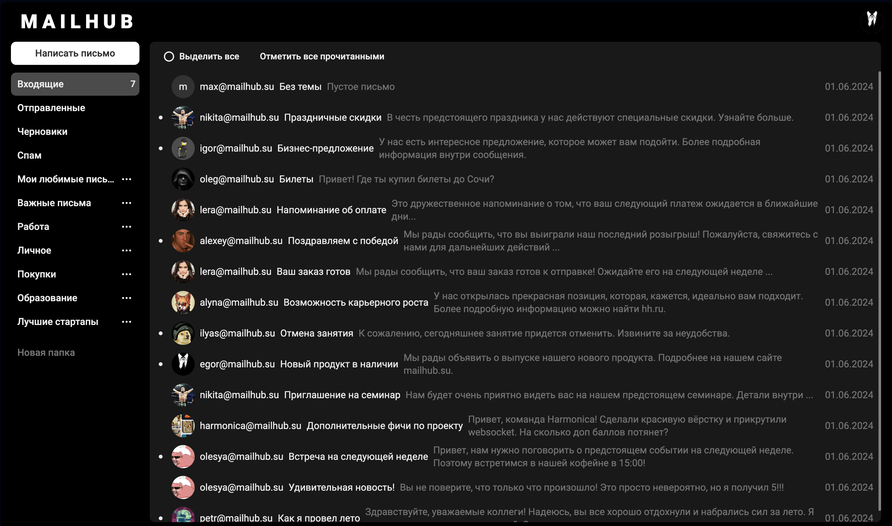
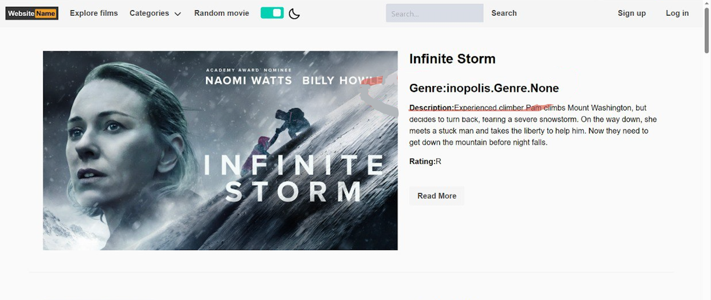
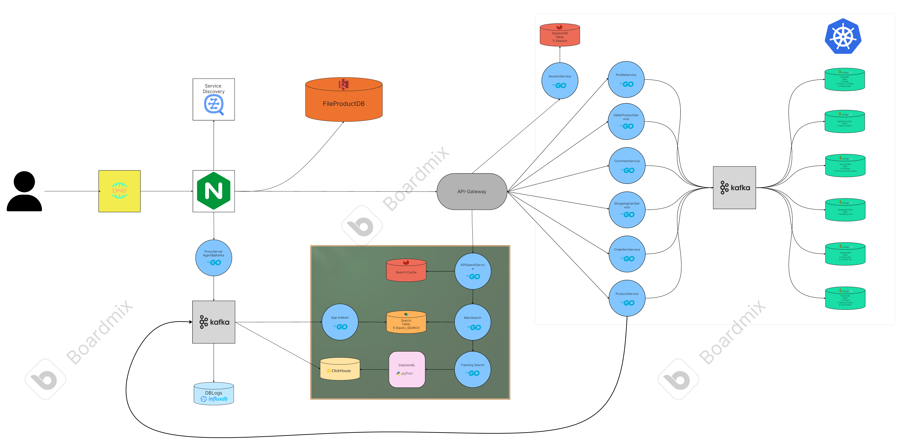

<h1>Hello, folks!</h1>

  

I am a meticulous and purposeful undergraduate student, I am fond of programming on a competitive basis, my area of interest is Web development.

🔭 I have  worked as a

I am currently studying at the BMSTU at the Department of Mechanical Engineering Technologies (Bachelor's degree program). My experience includes taking various retraining and advanced training courses:
1. **Web developer (VK company)**
   
   During the training, the "Questions and Answers" service was written in the Python Django framework (<a href="https://github.com/Fedasov/Question-Answer">project</a>), as well as the courses "Algorithms and data structures", "System Design", "DBMS", "Frontend development" and "Interface Design". Also, during the training process, my team was engaged in the development of a MailHub startup (<a href="[https://github.com/Fedasov/MailHub](https://github.com/go-park-mail-ru/2024_1_Refugio)">project</a>), in which I was engaged in Backend development in the Golang language.
2. **Web developer (Digital Department BMSTU)**

   During the training process, the "Kinopoisk" service was written in Python Django framework(<a href="https://github.com/Fedasov/DC_project">project</a>)
3. **C++ developer (OTUS)**

   Advanced training course in C++ (<a href="https://github.com/Fedasov/otus-cpp-basics">link</a>)
* <h3 align="left"> CV in Russian (actual 6.06.2024) - <a href="https://ryazan.hh.ru/resume/3bc2649bff0bfca10a0039ed1f4a366e785372">link</a>.</h3>
### Backend

### Frontend

### Database

## Tools

## Projects

| Name                                                                | Image                                         | Description                                                                                                                                                                           |
|---------------------------------------------------------------------|-----------------------------------------------|---------------------------------------------------------------------------------------------------------------------------------------------------------------------------------------|
| [Mailhub](https://github.com/go-park-mail-ru/2024_1_Refugio)        |                | Mailhub is a universal email system, offering secure and flexible message exchange for every user                                                                                     |
| [Кинопоиск](https://github.com/Fedasov/DC_project)                  |            | A web application with sections on cartoons and movies for all ages with content filtering (to broaden horizons and proper parenting)                                                 |
| [Highload Ozon](https://github.com/Fedasov/Highload_Ozon) |    | Calculation and explanatory note to the course work on the discipline "Design of high-load systems" Educational Center VK x Bauman Moscow State Technical University (ex. Technopark) |
| [Question-Answer](https://github.com/Fedasov/Question-Answer)       | -                                             | Question-Answer is a platform where you can ask questions and get answers from other users                                                                                            |
| [HTTPProxy](https://github.com/Fedasov/HTTPProxy)                   | -                                             | Proxy server for proxying http and https requests                                                                                                                                     |

  <g-emoji class="g-emoji" alias="chart_with_upwards_trend" fallback-src="https://github.githubassets.com/images/icons/emoji/unicode/1f4c8.png">📈</g-emoji>
  <strong>GitHub stats: </strong>

 
   

<h2 align="center">Interesting facts about me: ✨ I love programming + sports + phonk✨</h2>
<h2 align="center">Connect with me! </h2>

